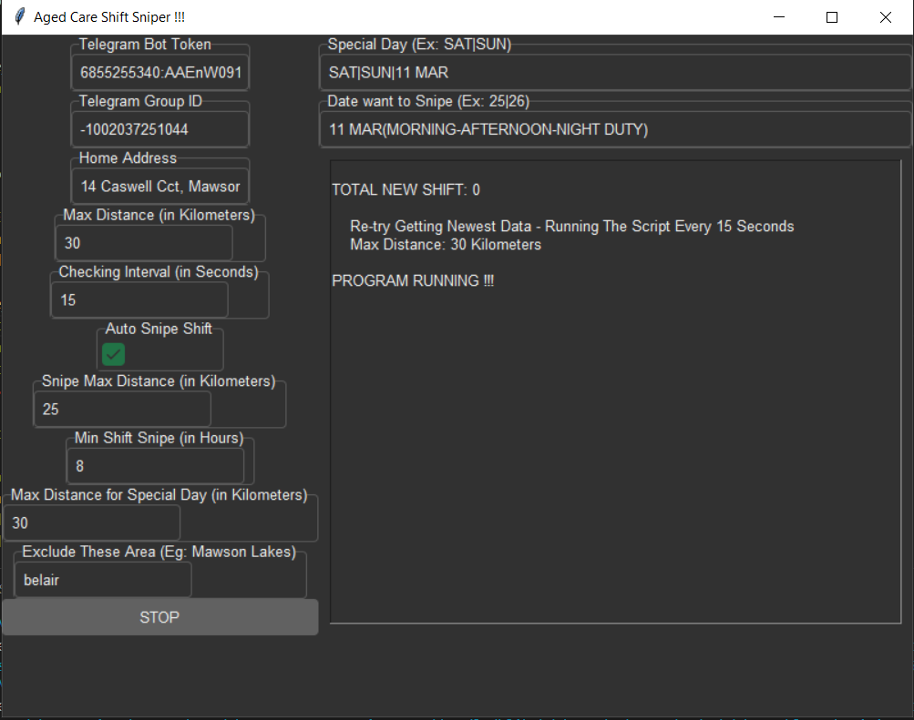

# Automated Shift Sniper

## Overview

This project aims to automate the process of sniping shifts for healthcare workers from a specified website. It's built using Python and various libraries like BeautifulSoup, requests, and threading to fetch, process, and analyze shift data from the website.

## Features

- **Shift Sniping**: Automatically snipes shifts that meet certain criteria, such as distance from home, shift duration, and specific days.
- **Telegram Integration**: Sends notifications and updates via Telegram, allowing users to stay informed about the status of the program and any sniped shifts.
- **Dynamic Configuration**: Allows users to customize settings such as maximum distance, checking interval, and exclusion areas through a user-friendly interface.
- **Data Persistence**: Stores shift data, previous shift lists, and configurations in JSON files for persistence between program executions.

## How it Works

The program fetches shift data from a specified website, processes it to identify shifts that meet sniping criteria, and automatically snipes eligible shifts. It then sends notifications via Telegram to inform the user about the sniped shifts and any relevant updates.

## GUI

## Usage

1. **Setup Configuration**: Enter your Telegram bot token, group ID, home address, maximum distance, checking interval, and other settings in the user interface.
2. **Start the Program**: Click the "START" button to begin the automated shift sniping process.
3. **Monitor Activity**: Keep an eye on the log text area to see real-time updates and notifications about the program's activity.
4. **Stop the Program**: Click the "STOP" button to stop the program whenever necessary.

## Requirements

- Python 3.x
- Libraries: geopy, requests, bs4 (BeautifulSoup), threading, tkinter, twilio

## Disclaimer

This program is intended for educational purposes and personal use only. It should not be used for any commercial or unethical purposes, such as spamming or unauthorized access to websites.
